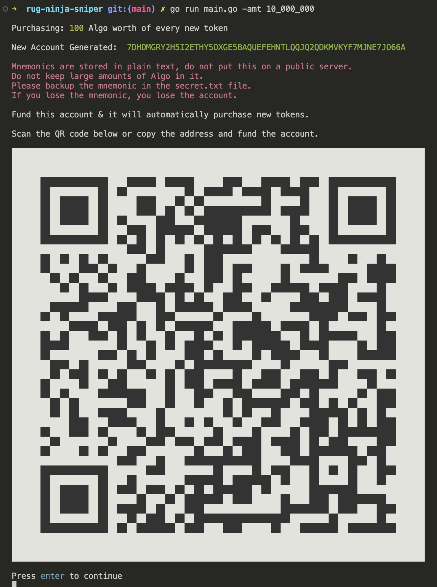

# Garbage Cat
A go based rug ninja mint sniper.

## Getting Started
This is a mint sniper bot for [Rug.Ninja](https://rug.ninja). It creates a new hot wallet and will purchase any newly minted tokens in the amount you set ( defaults to 1 algo )


### Prerequisites
You'll need go 1.22.1 installed on your local machine. See https://go.dev/ for installation instructions or use Homebrew on MacOS.

### Running the Server

> [!NOTE]
> #### Flags
> `-amt` : The amount of Algo to spend for every newly minted token

You can compile and run the server with the following command ran from the root of the project:
```bash
go run main.go -amt 10_000_000
```

### First Run

The first time you run the garbage cat server it will generate a new Algorand account.

> [!CAUTION]
> Garbage Cat takes no responsibility for loss of funds,<br>
> <b>he's a cat.</b><br><br>
> You as the operator of this free, open source software are solely responsible for keeping your new account safe & backing up your mnemonics.



Fund the account with some Algo & whenever it detects a new rug ninja token mint, it will instantly purchase the amount you set when you started the server.